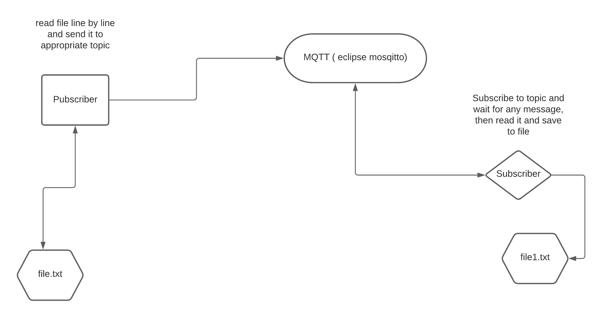

# tech_task
Queue between a file reader and writer 

We need to create docker container with Eclipse mosquitto ( or any other message queue brocker )
and two files - subscriber and publisher

Run mosquitto in docker  ( attached to terminal to view logs )
```
docker run -it -p 1883:1883 -v `pwd`/config:/mosquitto/config eclipse-mosquitto

```

checking it 

```
docker ps
CONTAINER ID   IMAGE               COMMAND                  CREATED         STATUS         PORTS                                       NAMES
76a0584b6a17   eclipse-mosquitto   "/docker-entrypoint.…"   7 seconds ago   Up 6 seconds   0.0.0.0:1883->1883/tcp, :::1883->1883/tcp   modest_goldwasser

```

Then, when the message queue swevre was started rum subscriber code

```
#!/usr/bin/env python3
import paho.mqtt.client as mqtt

client = mqtt.Client()
client.connect("127.0.0.1",1883,60)

incoming_file = open("infoming_file_from_queue.txt", "w+")

def on_connect(client, userdata, flags, rc):
  print("Connected with result code "+str(rc))
  client.subscribe("topic/test")

def on_message(client, userdata, msg):
  print(msg.payload.decode())
  incoming_file.write(msg.payload.decode())

client.on_connect = on_connect
client.on_message = on_message
client.loop_forever()

```

after it start publisher 

```
#!/usr/bin/env python3
import paho.mqtt.client as mqtt
client = mqtt.Client()
client.connect("127.0.0.1",1883,60)
with open('requirements.txt') as file:
   for line in file:
       print(line)
       client.publish("topic/test", line);
       if 'str' in line:
          break
client.disconnect();

```

Publisher open the file, read it line by line send it to appropriate topic to message brocker,
Subscriber subscribe to topic and save all messages in topic to $incoming_file. 
When the subscriber is closed, file waf flushed and saved .



